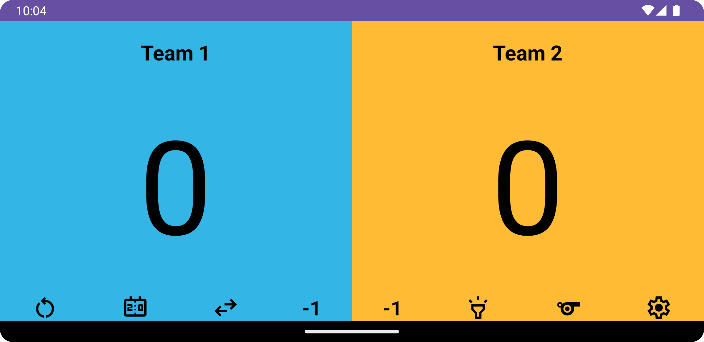
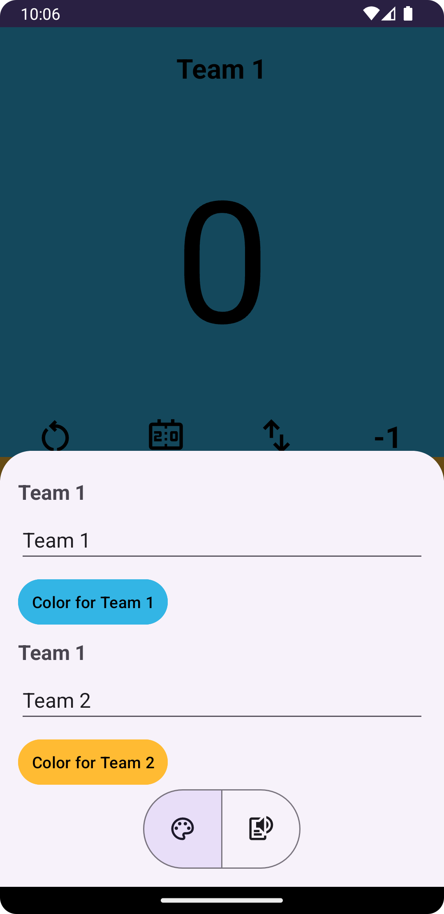

# Loud Scoreboard

This app was born from the necessity of a scoreboard app that announced the score using the
text-to-speech function, the ones that I have found with similar function did not get the focus for
the audio (like when there is music playing).

One thing that also distinguish it from other apps is that it shows on the lock screen, so if you
want to pass your cellphone to another person to mark down the score, you can lock your phone.

## Features

- [x] Show score
- [x] Add and subtract from score
- [x] Reset button
- [x] Swap button
- [x] Whistle button
- [x] High contrast button
- [x] Points announcement
- [x] Teams announcement
- [x] TTS speed rate and pitch sliders
- [x] Change background colors
- [x] Settings screen
- [x] Translations in EN (default), PT and ES

## TODO

- [ ] More colors
- [ ] TTS locale
- [ ] Game timer
- [ ] Picture-in-Picture
- [ ] Change points increment number
- [ ] Improve app logo
- [ ] Add other sounds to replace the whistle
- [ ] Add points limiter
- [ ] Change announce order

## Previews

### Scoreboard Screen

### Scoreboard Screen Horizontal

### High Contrast mode

### Settings Bottomsheet - Palette

### Color Picker Dialog

### Settings Bottomsheet - Text-to-speech

## Credits

- DataStore logic from [delasign](https://www.delasign.com/blog/android-studio-kotlin-data-store/)
- Icons from [Google Fonts](https://fonts.google.com/icons)

Feel free to contribute by opening issues, PRs or forking!
